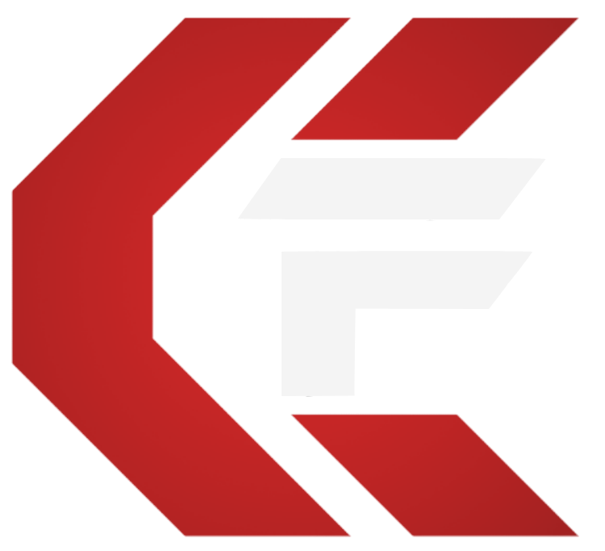

# CyberForce FSTT

**Building Morocco's Cybersecurity Future**

[Live Demo](https://cyberforce-fstt.github.io/) • [About](#about-cyberforce) • [Get Involved](#get-involved)

---

## About CyberForce

CyberForce is the official cybersecurity club of the Faculté des Sciences et Techniques de Tanger (FSTT), founded in 2025. We are a community of students and security enthusiasts focused on learning, competing, and contributing to information security in Morocco and the broader region.

Our mission is simple: empower the next generation of cybersecurity professionals through hands-on learning, collaborative problem solving, and real-world security challenges.

Key pillars:
- Security First — ethical practices and responsible disclosure
- Community Driven — collaborative learning and knowledge sharing
- Innovation — pushing boundaries in security research
- Hands-On Learning — practical experience through projects and competitions

---

## What We Do

- 🛡️ CTF Competitions — local and international Capture The Flag events  
- 🎓 Workshops & Training — web security, network security, cryptography, etc.  
- 👥 Community Building — meetups, mentorship, and networking with industry pros  
- 🔬 Research & Projects — open-source tooling and security research collaborations  
- 🏆 Competitions — team representation at national/international events

---

## Tech & Platform

Our official website and tooling use modern, developer-friendly technologies:

- Frontend: SvelteKit (v5), TypeScript, Vite  
- UI: TailwindCSS (4.0), shadcn-svelte, Lucide icons  
- Backend: PocketBase (auth, DB, file storage), REST API integration  
- Deployment: GitHub Pages, PocketHost, GitHub Actions for CI/CD

Live demo: https://cyberforce-fstt.github.io/

---

## Features (Website Highlights)

- Theme-aware design with light/dark modes and OKLCH color system  
- Terminal-style, secure contact interface (encrypted submissions to PocketBase)  
- Events & workshop calendar with registration support  
- Member profiles with role-based access, badges, and contribution tracking  
- CTF achievements, leaderboards, team stats, and challenge write-ups

---

## For Contributors

We welcome students, alumni, and the open-source community.

Getting started:
1. Fork the repository: https://github.com/cyberforce-fstt/cyberforce  
2. Create a branch:
   git checkout -b feature/your-feature
3. Follow coding guidelines in .github/copilot-instructions.md
   - Use Svelte 5 runes ($state, $derived)
   - Keep theme colors in app.css (no hardcoded colors)
   - Maintain TypeScript types and strict checks
4. Commit, push, and open a pull request

Development commands:
- pnpm dev — start dev server
- pnpm build — build production assets
- pnpm check — type checking
- pnpm lint — linting
- pnpm format — code formatting

Prerequisites:
- Node.js 20.x+
- pnpm 10.x (recommended)
- Git

Environment example:
PUBLIC_POCKETBASE_URL=http://127.0.0.1:8090

PocketBase: start with ./pocketbase serve and create collections via the admin UI.

---

## Roadmap

Planned items:
- Member authentication (in progress)
- Event management & registration system
- CTF leaderboard and analytics
- Member directory & workshop registration
- Blog/news and Discord/email notifications

Completed highlights:
- Homepage, About page, terminal-style contact, theme system, and PocketBase integration

---

## Team & Roles

Leadership:
- President — club direction & strategy  
- Vice President — operations & coordination  
- Secretary — documentation & communications

Technical:
- Lead Developer — platform architecture  
- Security Lead — CTF coaching & challenge design  
- DevOps Lead — infrastructure & deployment

Community:
- Events Coordinator — planning & logistics  
- Marketing Lead — outreach & social media  
- Design Lead — visual identity & UX

(If you'd like to be listed with a role here, open an issue or contact us.)

---

## Contact & Socials

- Email: contact@cyberforce-fstt.ma  
- Location: FSTT, Tangier, Morocco  
- Instagram: https://instagram.com/cyberforce.fstt  
- GitHub: https://github.com/cyberforce-fstt  
- LinkedIn: https://linkedin.com/company/cyberforce-fstt

---

## License

This project is licensed under the MIT License. See the LICENSE file for details.

---

## Acknowledgments

Thanks to:
- FSTT Tangier for support  
- shadcn-svelte and the Svelte community  
- PocketBase for the backend simplicity  
- Our members and contributors for making CyberForce possible

---

Built with ❤️ by CyberForce FSTT — Securing the Future, One Hack at a Time

